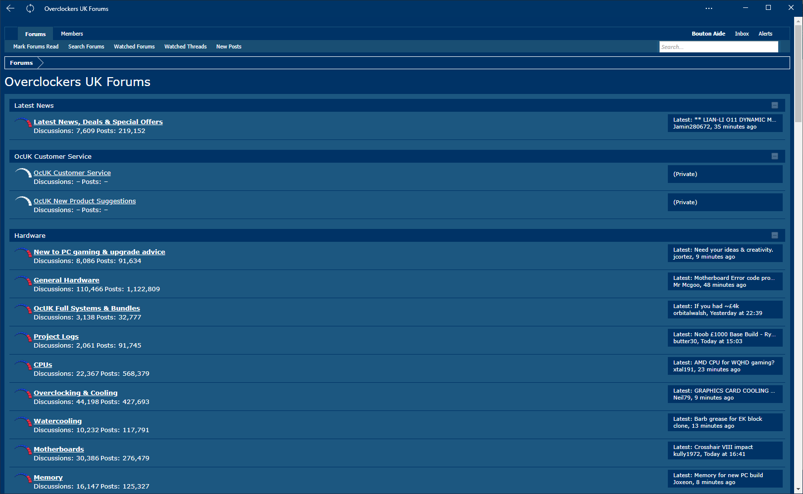
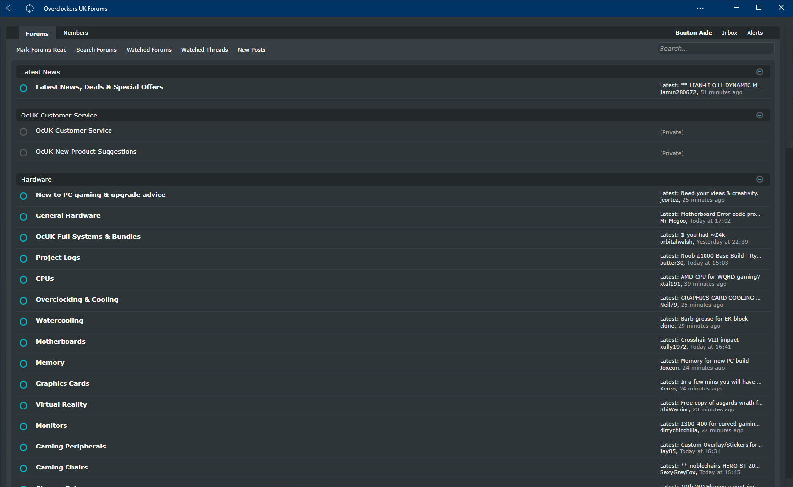
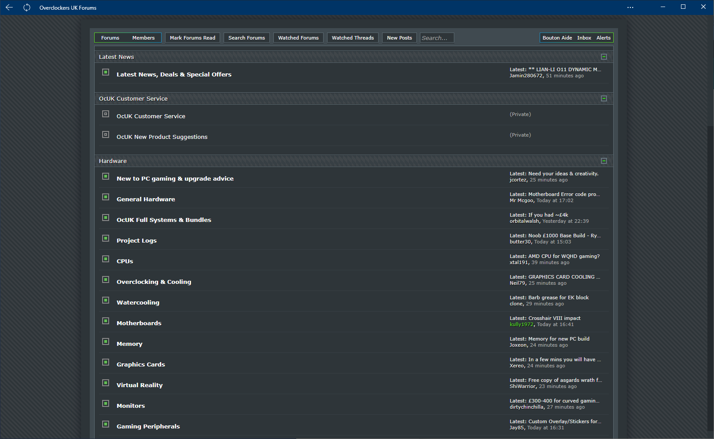

<h1 align="center">
	OcUK Clutter Be Gone Theme
</h1>

	
	
	
		
		

<h3 align="center">
	Designed by Wiiija and Nexus18
</h3>

	<strong>
		<a href="https://www.overclockers.co.uk/forums/" target="_blank">Forum Website</a>
		•
		<a href="https://www.overclockers.co.uk/forums/threads/the-ocuk-new-stylish-themes-thread-2017.18769736/">Thread Discussion</a>
	</strong>

	

	    
	    
	

## Description
This removes a lot of duplicate and unnecessary UI elements, which makes for a much more minimal forum browsing experience. Nearly every piece of code has a comment above it to describe what it does.

All of this code has either been provided by "wiiija", "mortals" or "fairly sure the answer is no" on ocuk forums.

If you use and like feel free to buy me a coffee, paypal: rail.monkey@ntlworld.com

<b>Author</b> - Sean Mayes and Nexus18  
<b>Date Created</b> - February 19, 2017  
<b>Applies To</b> - overclockers

## Notes
To use these themes you will need the Stylus/Stylish browser extension for your chosen browser or forks of listed browsers (vivaldi, palemoon etc):

<a href="https://addons.mozilla.org/en-GB/firefox/addon/styl-us/">Firefox</a>
•
<a href="https://chrome.google.com/webstore/detail/stylus/clngdbkpkpeebahjckkjfobafhncgmne?hl=en">Chromium</a>
•
<a href="https://addons.opera.com/en-gb/extensions/details/stylus/">Opera</a>
•
<a href="http://sobolev.us/stylish/">Safari</a>    
If you want to mix OcUK-Theme-Clutter-Be-Gone with this one just install another theme and tick both themes inside Stylus/Stylish for it to take effect! 

## Installation
> 01. Once you have the Stylus browser extention installed instructions above.  
> 02. click the "Install directly with Stylus" icon at the top of this page.  
> 03. Enable it in the Stylus/Stylish extension if it isn't already.  
> 04. Load the ocuk forum and the layout should have changed.
	
## Issues
If you have an issue, change request or comment about this theme please report it below: 
<a href="https://github.com/el-profesor926/OcUK-Theme-Clutter-Be-Gone/issues">/OcUK-Theme-Clutter-Be-Gone/issues</a>
